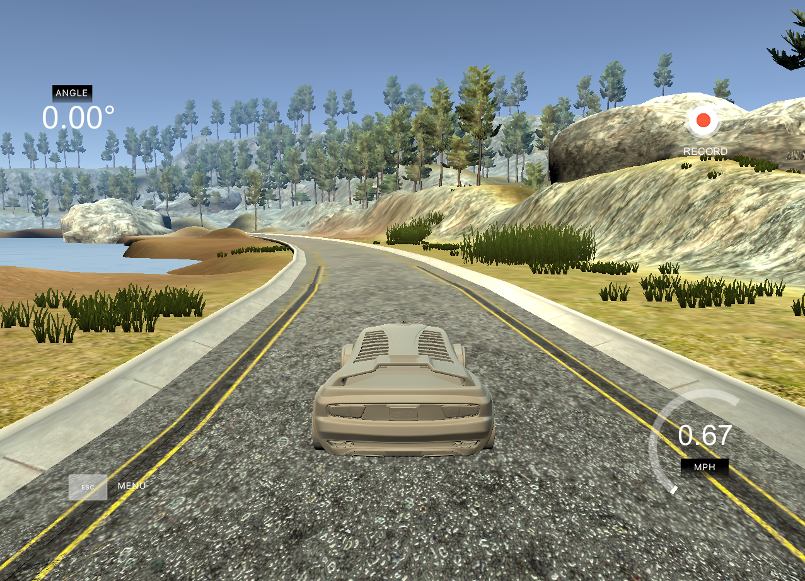
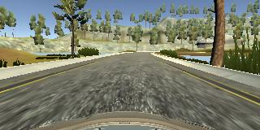

# SDC_in_simulator

To autonomously drive a car in a  simulated world using behavioral cloning. This can be done using traditional approach as well as deep learning approach.

## Simulator 

Simulator used in this is created by [Udacity](https://www.udacity.com/). This simulator contains two modes 

* Training mode
* Autonomous mode

You can download it from this [repo](https://github.com/udacity/self-driving-car-sim). And training mode looks like

<div align="center"></div>

To drive car autonomously open simulator and click on autonomous mode and then run

```sh
python drive.py model.h5
```

## Training

For deep learning approach, I have trained a CNN (**Lenet** configuration and modified it a bit) with data provided by Udacity and collected some using simulator. 

Data contains 

* Steering angle at that specific time

* Three pictures from cameras at left, right, center of the car

* Speed at that specific time

* Throttle at that specific time

  But as of now I have used only data from center of the car and steering angle and it looks like this 

<div align="center"></div>

## Results

Using deep learning approach model is driving good but in some cases like sharp turning model is not driving smoothly (but more data and a bigger network can deal with this problem). You can see it here https://youtu.be/0cm4fpY_BcU.

<div align="center"><a href="https://github.com/vstark21">&copy V I S H W A S</a></div>