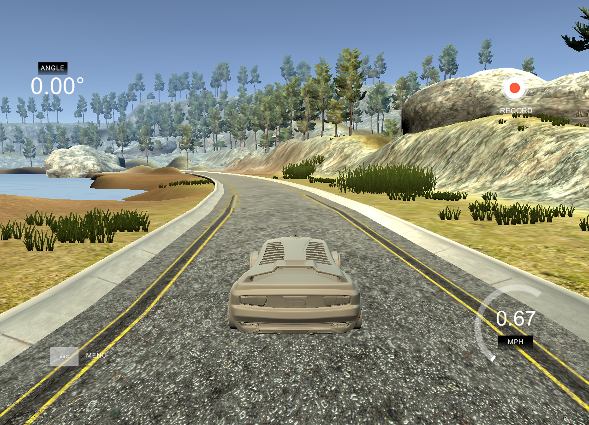
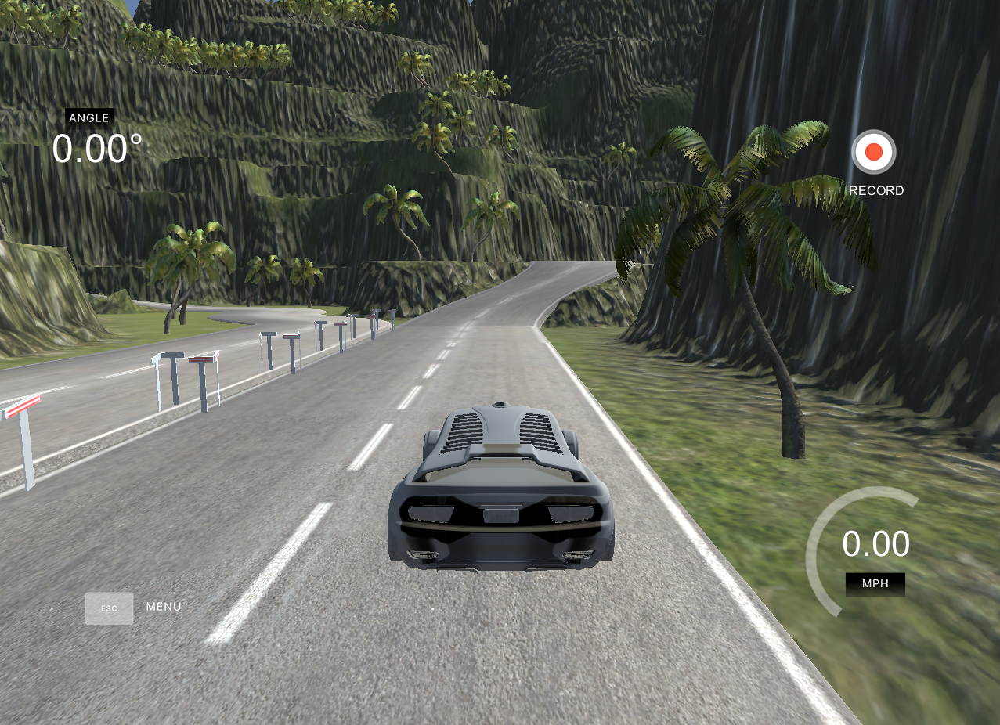
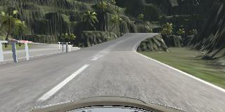
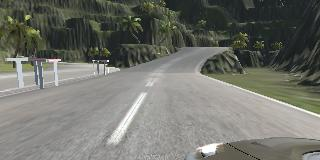
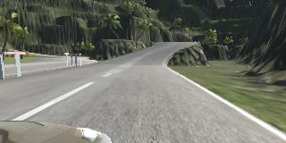
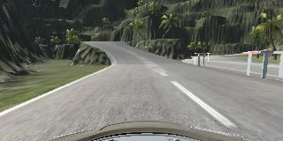

# SDC_in_simulator

Driving a car autonomously in a  simulated world using [behavioral cloning](https://link.springer.com/10.1007%2F978-0-387-30164-8_69#:~:text=Behavioral%20cloning%20is%20a%20method,input%20to%20a%20learning%20program.). This can be done using traditional approach as well as deep learning approach.

You can see a glimpse here

<div align="center"></div>

## Simulator 

Simulator used in this is created by [Udacity](https://www.udacity.com/). This simulator contains two modes 

* Training mode
* Autonomous mode

You can download it from this [repo](https://github.com/udacity/self-driving-car-sim). And training mode looks like

| Track-1                                      | Track-2                                      |
| -------------------------------------------- | -------------------------------------------- |
|  |  |

To drive car autonomously open simulator and click on autonomous mode and then run in this folder

```sh
python drive.py model.h5
```

## Approach

For both of the tracks, I trained a CNN (Modified **Lenet** architecture) with data provided by Udacity and collected some using simulator. 

Data contains 

* Steering angle at that specific time
* Three pictures from cameras at left, right, center of the car
* Speed at that specific time
* Throttle at that specific time

For **Track-1** training, I used images from center of the car and respective steering angles. It looks like this 

<div align="center"></div>

But for **Track-2** training, I used images from center, left, right and flipped image of center image to train the network and used steering angle data in this way

| <small>Center Image</small>    |  <small>Left Image</small> |  <small>Right Image</small> |  <small>Flipped Center Image</small> |
| ----------------------------------------------------------- | ----------------------------------------------------- | ------------------------------------------------------- | ------------------------------------------------------------ |
| `steer_angle` <small>(data obtained from simulator)</small> | `steer_angle + 0.5`                                   | `steer_angle - 0.5`                                     | `steer_angle * -1`                                           |

## Results

Model is driving good but in some cases like sharp turnings, model is not driving smoothly (but more data and a bigger network can solve this problem). 

You can see them here 

* Track-1 - https://youtu.be/0cm4fpY_BcU.
* Track-2 - https://youtu.be/56EvVMi6otk

<div align="center"><small><a href="https://github.com/vstark21">&copy V I S H W A S</a></small></div>